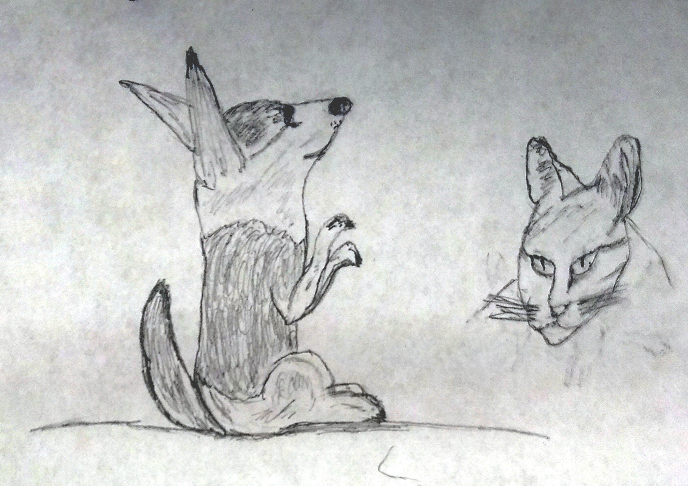

In this series of posts I will explain the creative process used to make my personal website using Gatsby. The tools and techniques used in creating my website can be used to create any number of websites for different purposes. I want to use my website for the following:
- share the creative process of my projects
- get feedback from people
- provide useful information to myself and others now and in the future
- ???
- profit

There are a number of different projects that I want to make, so having these articles will also exist as an up-to-date guide on how I can create websites for my personal projects projects. By the end of this guide I hope someone with some technical expertise should be inspired and able to set up a free basic website for their own use. What an awesome skill to have which unleashes vast creative potential!

## Development Environment

### Choosing a Website Development Environment

I wanted to use a static website mainly because it is easy to deploy a free site using [Github Pages](https://pages.github.com/), and I have experience developing a website using Jekyll in the past. In addition, static websites are also relatively safe (albeit still vulnerable to [some attacks](https://blog.sqreen.com/static-websites-security/)) and fast. I looked around for a modern static website development platform, and found Gatsby.

Advantages of using Gatsby includes:
- Extensive plugins to fulfill common goals
- Insertion of React.js components into markdown pages using [MDX](https://www.gatsbyjs.com/docs/how-to/routing/mdx/) instead of [regular markdown](https://www.gatsbyjs.com/docs/reference/markdown-syntax/)
- Quick and easy testing with a local development server

### Setup

I create articles, take notes, and write code using a fairly simply markup language called [Markdown](https://www.markdownguide.org/getting-started) inside of a free open-source integrated development environment (IDE) called [Visual Studio Code](https://code.visualstudio.com/). Within this program I can take notes, commit changes to git, run programs from the terminal, debug certain kinds of languages, and much more.

To get started with Gatsby using your specific operating system, the team at Gatsby provides a [great tutorial](https://www.gatsbyjs.com/docs/tutorial/).  

## Creating a Theme

The main subject of the website is myself and the current things I am working on or am interested in. It is a place for me to express my creativity and thoughts. I have a multitude of interests, and spirals are cool, so I thought I could use a spiral as the main thematic way of organizing data on my website.

Each node on the spiral represents a topic that I am interested in. Some stuff that I am interested in includes:
  - gardening
  - art
  - programming
  - nutrition
  - exercise

### Drawing Concept Art

I started off by drawing some concept art. My grandma and I had an awesome time sitting down to draw together, and she made beautiful drawings of animals and flowers. I took multiple pictures with my camera and made a composite blend in GIMP. These are a few of her quick sketches:




For my website, I thought of making a sunflower or other circular object which has a golden ratio spiraling stalk coming out of it in the background. The stalk has leaves that spiral around the stem as the user scrolls the mousewheel. Some of the leaves of the stalk contain information. The leaves around the stalk that contain info could have a word and picture of what I am talking about. If the leaf has enough room, it grows in size and displays the topic with more detail. Here is the concept art I originally drew:


### Programming a Spiral 

After creating some concept art, I started implementation on the code. The first step was to create a spiral component. The first iteration used a [golden ratio spiral](https://en.wikipedia.org/wiki/Golden_spiral), but I decided that it would make more sense to have an [archimedean spiral](https://en.wikipedia.org/wiki/Archimedean_spiral) so that the components within the spiral would be of a consistent size. I made the spiral component modular so it could be reused between different web pages. Here is the first iteration (a Golden Spiral):

<GoldenSpiral offsetAngle={0}/>

With the help of useful equations that represent spirals on Wikipedia and a great tutorial for how to [interact with the HTML5 canvas using react components](http://www.petecorey.com/blog/2019/08/19/animating-a-canvas-with-react-hooks/) by Pete Corey, the logic to draw the spiral itself ended up being fairly simple:

```javascript
function drawSpiral(canvasContext) {
    let width = canvasContext.canvas.width
    let height = canvasContext.canvas.height

    // Move to center of canvas
    let centerPoint = getSpiralCenter(width, height)
    let x = centerPoint.x,
        y = centerPoint.y
    canvasContext.beginPath()
    canvasContext.moveTo(x, y)

    // maxRadius is defined as the line distance from the
    // center of the canvas to the farthest corner
    let canvasBounds = { left: 0,
                         top: 0, 
                         right: width,
                         bottom: height }
    let maxRadius = getMaxRadius(centerPoint, canvasBounds) 

    // While the radius of the spiral is within the bounds of the
    // canvas, iteratively draw lines that represent the spiral
    let angle = 0
    let r = 0
    while (r < maxRadius) {
        r = scale * Math.pow(phi, angle)
        let [offset_x, offset_y] = polarToCartesian(
            r,
            angle + offsetAngle
        )
        x += offset_x
        y += offset_y
        canvasContext.lineTo(x, y)
        angle += stepSize
    }
    canvasContext.lineWidth = 2
    canvasContext.stroke()
  }
```

Full component code can be found on [my github](https://github.com/BHennen/bhennen.github.io/blob/main/website/src/components/spiral.js).

## Evaluating my Progress

### Issues with React Hooks

While messing with [react hooks](https://reactjs.org/docs/hooks-intro.html), I wanted the spiral component to have its properties updated by other components such as sliders. Unfortunately hooks do not allow you to do this in an independent way; a component **A** that wants to interact with the stateful component **B** must be a child of component **B** because state is *local* to its component and is not exposed in a way that can be used by sibling components. What a bummer!

Luckily there are other options. After researching, the one I will use in the future is [Redux](https://redux.js.org/introduction/getting-started), which is a library that allows for access to a global object that stores the state of the app (they call the object a **store**). One can change the global state by passing an action object into the *dispatch* function of the store, which gets processed by a user-defined *reducer* function that maps the current (state, action) pair to a new state.

[Using Redux with gatsby](https://www.gatsbyjs.com/docs/adding-redux-store/) is also pretty easy to do.

### Making a Unique Design Has Drawbacks

After working on the site for a while and thinking about its ultimate purpose (which is to be a source of good information, a revenue stream, and a place to connect with people), I decided I need to spend more time focusing on *getting things working, published, and accessible*, rather than focusing on the aesthetics, at least for now. Rather than spend the majority of my time making things pretty, I should spend more time getting things done.

I like the idea of the spiral but I will keep it in the back of my mind as I work towards developing a *fully functional* website. I will still use modern technologies because they provide useful tools in the form of plugins and libraries and I now know what they are capable of doing. 

## Future Work

In the following posts I will detail how I made a more traditional design that is easily understandable to the end-user, more accessible, and quicker to iterate upon.

