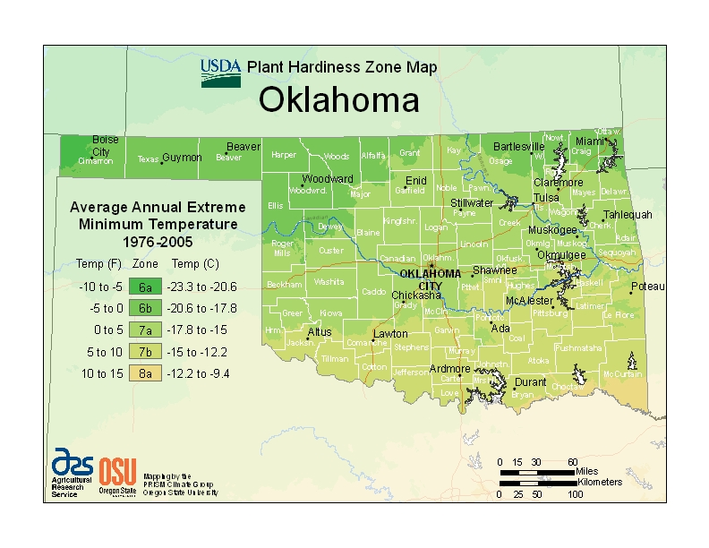
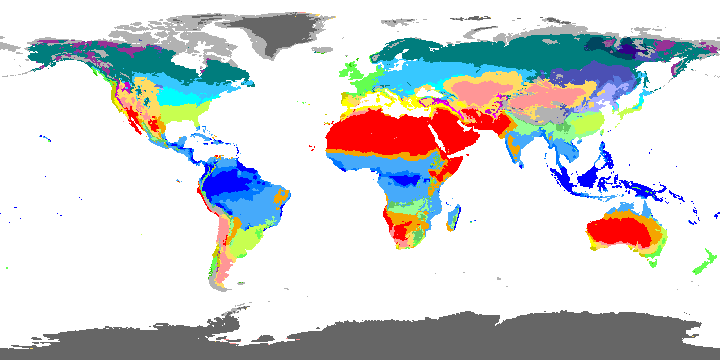
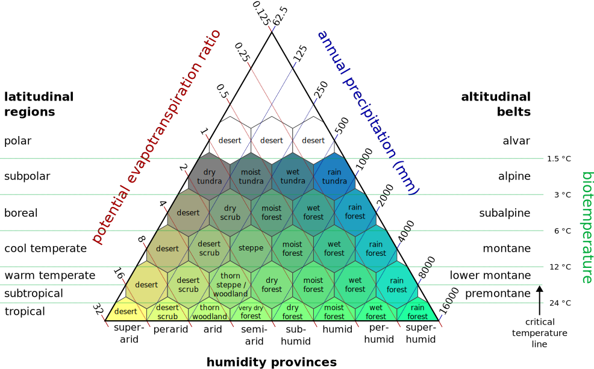
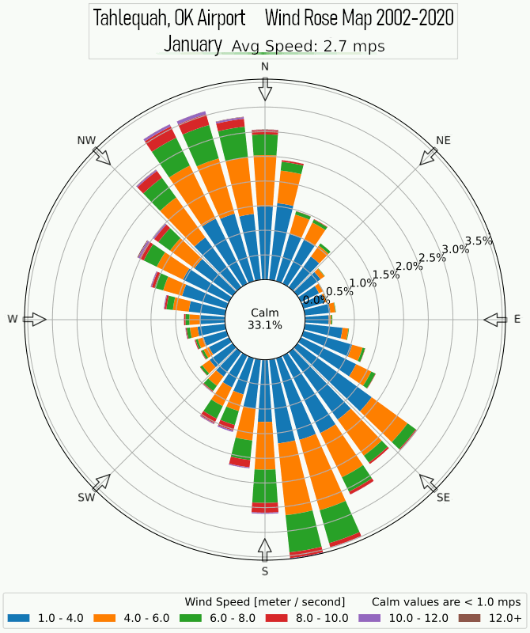
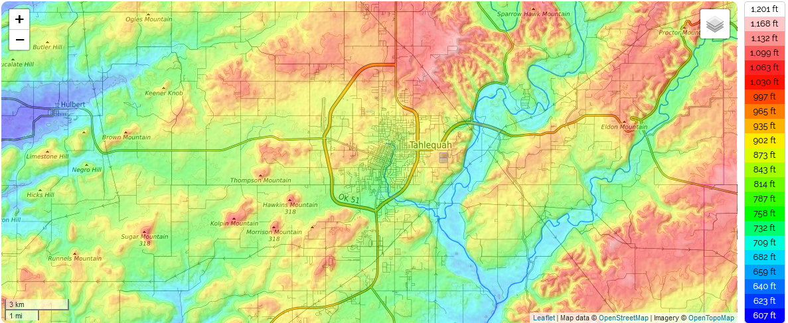

<!--
TODO:
- make image component be stylized to allow for source information
 -->

Knowing and having gratitude for the inputs and outputs to our body, our land, our surrounding regions, and our global ecosystem that is our Earth will allow us to better fulfill the needs of our community and create a life which is more suitable for ourselves in our local area. By exploring our Earth and our history from a local perspective we can plan around events that occurred in our past or learn about and use resources around us which we might have otherwise overlooked. We can perform a **geographical survey** to study our local climate, topography, geology and soil, and the lifeforms that make up and surround us. By combining mindfulness of our Earth with an emotion of gratitude and thankfulness for nature and our existence, we can create better thoughts about our imagined future that lead to better actions which will enhance our lives in the everlasting present moment.

Throughout this lesson the geographical location that we will use as an example is Tahlequah, Oklahoma, USA. 

## Climate

The climate of our lands directly affects which and how many lifeforms can prosper there. It is important to stay mindful about changes that occur to our local climate so that we can plan accordingly.

### Climate Classification

Various regions of our Earth experience similar climatic conditions that allow similar types of lifeforms to flourish in those areas. We can use our classified region to grow many of the same lifeforms that grow in other similar regions. The following are some examples of classification systems that describe and model these regions:

- #### [USDA Hardiness Zone](https://planthardiness.ars.usda.gov/PHZMWeb/)
  
  Image source: "USDA Plant Hardiness Zone Map". Prism Climate Group Oregon State University. USDA. Agricultural Research Service. URL: https://planthardiness.ars.usda.gov/PHZMWeb/

  The USDA Plant Hardiness Zone Map is produced by and is available for the USA. It can be adapted to other regions around the world by using that region's temperature data. The USDA states that, "The map is based on the average annual minimum winter temperature, divided into 10-degree F zones." It useful but keep in mind that plant species depend on other data besides just temperature, which is why other classification systems were developed.

  As can be seen above, our example geographical location, Tahlequah (in the northeastern region of Oklahoma), resides in zone 7a. This signifies that the mean minimum annual temperature in that region historically ranges from -17.8 to -15 °C (0 to 5 °F).

- #### [Köppen-Geiger climate classification](https://www.ncbi.nlm.nih.gov/pmc/articles/PMC6207062/#__sec1title)

  
  Image source: [CC BY-NC 4.0](https://creativecommons.org/licenses/by-nc/4.0/): Beck, H.E., N.E. Zimmermann, T.R. McVicar, N. Vergopolan, A. Berg, E.F. Wood: Present and future Köppen-Geiger climate classification maps at 1‑km resolution, Scientific Data 5:180214, doi:10.1038/sdata.2018.214 (2018).

  According to Beck et al (2018), the Köppen climate classification scheme is based on seasonal variation in monthly air temperature and precipitation and regions are classified by the combination of those values within certain bounds. The bounds for the values are determined by the vegetation that grows in different regions, such that similar regions share similar vegetation. Beck et al created the updated map above using, "climatic air temperature and precipitation data from multiple independent sources, including WorldClim V1 and V2, CHELSA V1.2, and CHPclim V1".

  According to Köppen-Geiger classification, Tahlequah resides in zone Cfa, signifying that the region is a humid subtropical climate. This means the region is classified as being temperate, has no dry season, and has a hot summer.

- #### [Holdrigdge Life Zones](https://en.wikipedia.org/wiki/Holdridge_life_zones)
  
    
  Image source: [CC BY-SA 2.5](https://creativecommons.org/licenses/by-sa/2.5) Peter Halasz, https://commons.wikimedia.org/w/index.php?curid=1737503

  Holdridge life zones take into account more data about the climate of a region than the other classification schemes seen previously, however they do not take into account seasonal variability between regions nor the current state of vegetation that grows in an area. The following metrics are used to classify Holdridge climate zones:
  - Annual Precipitation: How much rain falls in a particular region in an average year.
  - Biotemperature: The mean annual temperature of a region. Mean monthly temperatures that induce dormancy in plants (less than 0 °C or greater than 30 °C) are set to 0 in the calculation.
  - Potential Evapotranspiration Ratio: Defined as the ratio of the amount of water leaving the system through transpiration or evaporation if enough water is available to the amount of water entering the system through precipitation.
  
  We can use Tahlequah as an example for determining its Holdridge life zone:
  1) Annual Precipitation: Tahlequah has a mean annual precipitation of 1275.842 mm.
  2) Biotemperature: Tahlequah has no months with a mean temperature colder than 0 or hotter than 30, so we take the mean annual temperature to determine the biotemperature, which is 15.56 °C.
  3) From these two metrics we can see that Tahlequah is a warm temperate moist forest, with a potential evapotranspiration ratio between 0.5 to 1, which means the region experiences more rainfall than what is lost through evaporation and transpiration.

### Local Climatology

Local climatology is more valuable than global climate zones because the data is gathered directly from our local area in which we live. Because of this we can gather much more information about our location than what is provided by a climate classification zone. Using this information we can estimate the potential amount of rainfall we can gather and store over the year, as well as knowing more specifically about our local growing conditions. The following information was provided by a weather monitoring station in the city:

Station Information:
- Elevation: 850 ft
- Latitude, Longitude: 35° 56' N, 94° 58' W

Tahlequah, OK | Jan | Feb | Mar | Apr | May | Jun | Jul | Aug | Sep | Oct | Nov | Dec | Annual
--|--|--|--|--|--|--|--|--|--|--|--|--|--
Average High Temperature | 49.0 | 54.0 | 63.4 | 72.1 | 78.5 | 85.5 | 90.8 | 91.5 | 83.5 | 73.0 | 61.4 | 50.2 | 71.1
Average Low Temperature | 27.1 | 31.5 | 39.8 | 48.4 | 57.3 | 65.0 | 69.2 | 68.1 | 60.4 | 49.5 | 39.5 | 29.5 | 48.9
Average Mean Temperature | 38.1 | 42.7 | 51.6 | 60.3 | 67.9 | 75.2 | 80.0 | 79.8 | 71.9 | 61.2 | 50.5 | 39.9 | 60.0
* Record High Temperature | 78 | 86 | 92 | 93 | 97 | 105 | 114 | 110 | 105 | 98 | 86 | 80 | 114
* Record Low Temperature | -13 | -9 | -10 | 20 | 30 | 42 | 45 | 48 | 28 | 17 | 6 | -14 | -14
Average Days Above 100 Degrees | 0 | 0 | 0 | 0 | 0 | 0 | 0.9 | 2.1 | 0.3 | 0 | 0 | 0 | 3.3
Average Days Above 90 Degrees | 0 | 0 | 0 | 0.1 | 0.2 | 5.4 | 17.2 | 19.4 | 5.3 | 0.1 | 0 | 0 | 47.8
Average Days Below 32 Degrees | 21.3 | 14.7 | 7.4 | 1.3 | 0 | 0 | 0 | 0 | 0 | 1.5 | 8.3 | 18.1 | 72.7
Average Days Below 10 Degrees | 2.0 | 0.9 | 0.2 | 0 | 0 | 0 | 0 | 0 | 0 | 0 | 0 | 1.6 | 4.7
Average Rainfall | 2.58 | 2.65 | 4.10 | 4.03 | 6.26 | 5.20 | 4.40 | 3.87 | 5.14 | 4.61 | 4.30 | 3.09 | 50.23
* Record Rainfall | 6.19 | 8.68 | 9.71 | 9.69 | 12.92 | 10.32 | 13.44 | 11.08 | 12.67 | 12.37 | 7.12 | 7.52 | 73.48
Average Number of Rain Days | 5.1 | 6.0 | 7.8 | 8.2 | 9.7 | 8.7 | 6.3 | 6.0 | 7.0 | 7.3 | 7.1 | 6.3 | 85.5
Average Snowfall | 2.0 | 1.6 | 0.4 | 0 | 0 | 0 | 0 | 0 | 0 | 0 | 0.2 | 1.3 | 5.5
* Record Snowfall | 17.5 | 11.4 | 18.0 | 2.6 | 0 | 0 | 0 | 0 | 0 | 0 | 4.7 | 7.4 | 20.2
Average Heating Degree Days | 836 | 623 | 425 | 188 | 44 | 3 | 0 | 0 | 28 | 169 | 443 | 780 | 3539
Average Cooling Degree Days | 0 | 0 | 10 | 46 | 134 | 310 | 465 | 459 | 236 | 53 | 7 | 1 | 1720

From this location specific data we can learn:
- Rainfall patterns: Tahlequah usually has relatively dry summers and winters, and relatively wet springs and falls. Knowing this allows us to plan for drought better by capturing water when it rains and spreading it out over the drier seasons. 
- Lifeform suitability: When we know more specifically about the temperature and rainfall conditions that support lifeforms in our area, we are empowered to determine when the best times to plant crops are for our region, and which lifeforms could thrive there each year.

## Sunshine

Our Sun is vital for our current existence. Lifeforms which have consumed our Sun's energy are consumed by other lifeforms to create a better future for everyone. We as humans also receive a direct benefit from the sun in terms of body warmth and vitamin D production. In addition, current technologies allow us to gather our Sun's energy and use it directly as heat or convert it into another form of power. To be mindful about Our Sun we must study our position relative to our Sun and think about how our Sun's position appears throughout the year from the viewpoint of our local sky. Using this knowledge we can plan for the future by creating a Sunshine and shade map.

<!-- TODO: Show plot of suns location in the sky for tahlequah -->
<!-- TODO: Make a shade map -->

### Our Sun Supports Life

Plants and animals need our Sun; like all things, however, too much exposure can lead to damage. For plants, too much sun exposure can result in photoinhibition (a reduction in the maximum photosynthetic rate) if the species is not adapted properly. This is based on evidence from the [photosynthesis-irradiance curve](https://biocyclopedia.com/index/algae/working_with_light/photosynthesis_irradiance_response_curve_p_versus_e_curve.php), which is a species dependent graph showing that as the solar irradiance increases the photosynthesis rate also increases, then plateaus, and finally declines as the species receives too much light. 

With this in mind, it is important to ensure that the lifeforms of our land are receiving the proper amount of Sun. We can use our shade-producing structures to our advantage by cultivating shade-tolerant plants in their shadows. We can also encourage tall plants to grow as a natural source of mottled light for shorter species. 

### Solar Energy

Similarly to plants, we can convert our Sun's energy into our other forms of energy for a renewed purpose such as a heat source or power production. Unlike plants, however, the more irradiance we can capture and put into our systems the better the system usually performs. We should be mindful that we don't take up useful space that could be used to serve another more valuable purpose in the future. A common place to put solar collectors is on top of our roofs or in barren areas of our land.

Solar collectors are able to capture more energy when facing toward our Sun. According to <https://globalsolaratlas.info/>, the optimum average tilt of solar energy modules for the Tahlequah latitude is 33 / 180°. However, if we tilt our modules throughout the seasons, months, days, or seconds (using 2-axis automation) we can maximize solar production by pointing directly at our Sun as our Earth rotates and orbits around it or as other obstacles block the sun. 

The following table shows the average irradiation of Tahlequah:

Data | Value
--- | ---
Direct normal irradiation | 1796 kWh/m2
Global horizontal irradiation | 1658 kWh/m2
Diffuse horizontal irradiation | 590 kWh/m2
Global tilted irradiation at optimum angle | 1902 kWh/m2

<!-- TODO: calculate square footage needed for average household -->

## Wind

Wind is a powerful force which we could harness as an energy source. We should also be mindful of the destructive capability of high speed winds and plan around where they typically come from and how fast they are blowing.

### Wind Patterns

We can create and use maps of wind frequency that tell us where the wind usually comes from and average wind speeds in those directions using wind rose maps. A useful resource to create those maps can be found at <https://mesonet.agron.iastate.edu/sites/locate.php>. For Tahlequah we would first select the network, which would be Oklahoma ASOS. Then we can select a local monitoring station (in this case the airport), and finally we can generate custom wind roses. This is a modified version I put together using [GIMP](https://www.gimp.org/):

How often the wind comes from each direction is shown by the length of the bar in each direction, with longer bars meaning the wind came from that direction more often. Wind speed is shown by the color within each bar. As seen in our example location, the strongest prevailing wind comes from the south-southeast. During the fall and winter months strong winds coming from south-southeast and north-northeast are about equally as likely.

Using this knowledge along with knowing about our local topography and how wind moves around mountains, forests, or other barriers, we can better determine where the wind will come from and how strong it will be in our specific location. 

### Preventing Wind Damage

We can prevent wind damage with natural means such as growing hedge rows or tall trees to act as a windbreak, slowing wind speeds through a desired region. For our example location it would make most sense to have our windbreak running in a line from east to west in order to block the north-south winds.

### Wind Energy

Although wind has the potential to be destructive, we can use the same potential energy to transform it into useful work. Using data from <https://globalwindatlas.info/> we can see the average wind speeds and using this information we can calculate the potential of harvesting wind energy in Tahlequah:

Elevation (m) | Wind Speed (m/s)
--- | ---
10 | 3.75-4.5
50 | 6.0-7.5
100 | 7.5-8.25
150 | 8.75-9.5
200 | 9.5+

<!-- TODO: Make a calculation for the total amount of wind energy in our area, and create potential ideas for harnessing the energy -->

## Topography

Image Credit: [CC BY-SA 2.0](https://creativecommons.org/licenses/by-sa/2.0). Retrieved from https://en-us.topographic-map.com/. Map data from https://www.openstreetmap.org/copyright and https://www.opentopomap.org/credits

We can determine the flow of rainfall and local sources of water by using local topographical features. Knowing how the water flows across and under our land will allow us to change our local topology to capture or divert water so that it is retained and used by the lifeforms of our region for a longer period by creating swales. Another advantage is that we can slow water runoff into streams and rivers to minimize downstream flooding and soil erosion.

If our region experiences too much rainfall we can channel the water so that it is diverted in a non-destructive way around our land so that our soil does not get waterlogged.

### Drainage Divide

The topology and geology of our lands determines the watershed our lifeforms are located on. Our actions directly influence our watershed and we must be mindful of the other lifeforms that share our watershed with us.

In the United States there are [tools](https://water.usgs.gov/lookup/getwatershed?11110103/www/cgi-bin/lookup/getwatershed) to help find out about your watershed and the health of it.

## More

There are plenty of other things to pay attention to regarding our Earth; it is up to each of us to determine what we find value in. The more we know the more we can better determine the effects of our current actions.

<!-- TODO 
## Geology

## Soil

## Additional Help

If you would like help with creating a well-researched and documented brochure about your own region of our Earth, please inquire at gooddoggyvibes@gmail.com.

Each brochure could contain custom maps and descriptions about your own property, including, but not limited to:
- vegetation planning maps
- sunshine and shade maps
- custom wind maps
- property boundary and dimension length maps
- custom topographical maps

I will work directly with you to determine which maps you would like me to create.

-->